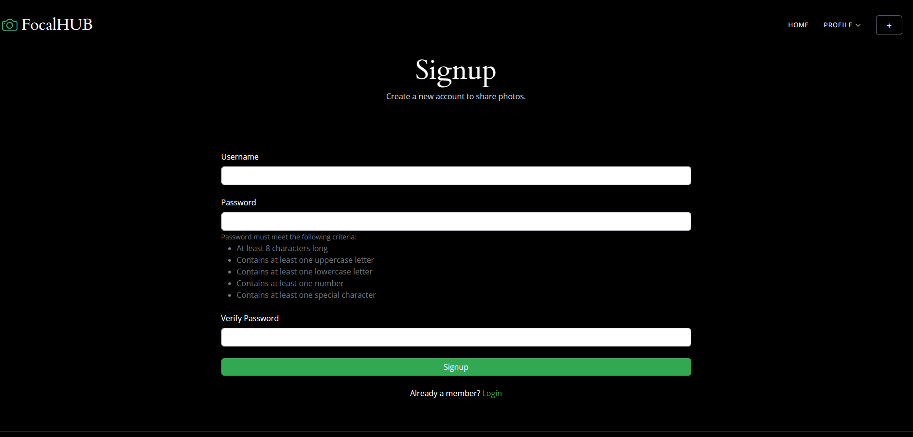
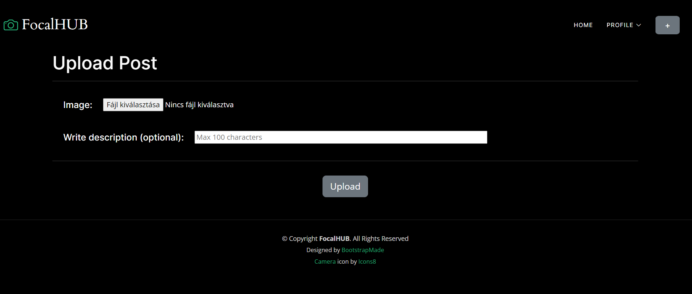
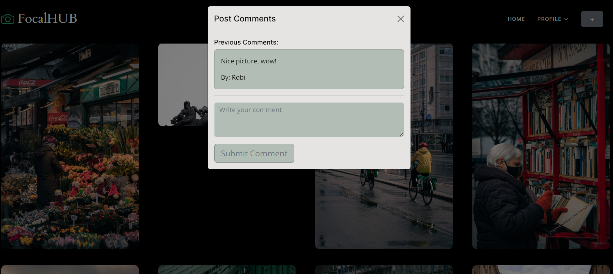
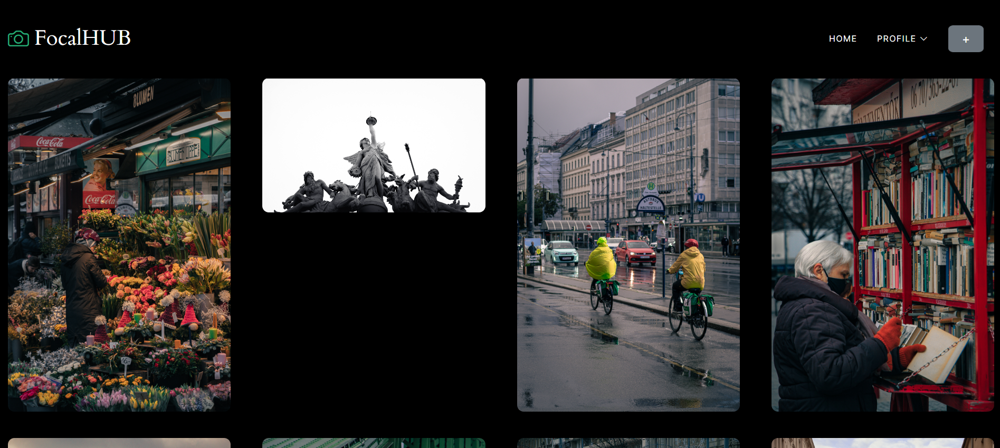
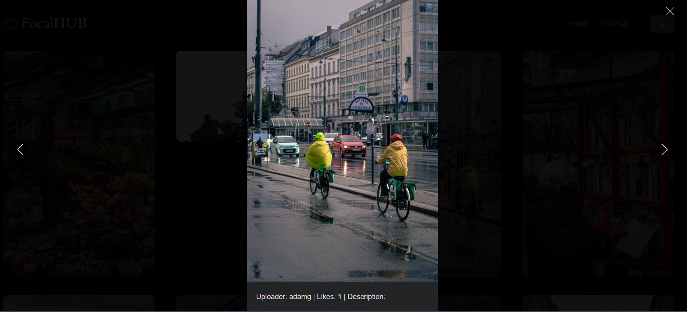
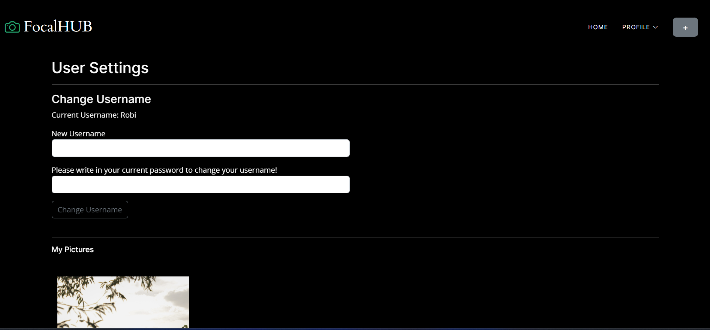

<h1>FocalHUB description/documentation</h1>
<h2>Overview</h2>
This documentation outlines the features and technologies utilized in the development of a photo-sharing social web page. 
The application is a full-stack web solution created using HTML, CSS, and JavaScript for the frontend, and Python with the Django framework for the backend. 
The backend includes an API that handles CRUD operations for user management, seamlessly integrated with a relational database for efficient data storage and retrieval.
Uploaded photos are securely stored on the local file system within the designated "media" folder. 

<h2>Features</h2>
<h3>User Authentication</h3>
<li>Users can securely log in/register, providing a personalized experience.</li>
<li>Log in is not nessesary to view photos, but is required to upload photos and interact with photos.</li>

<h3>Photo Upload and Management</h3>
<li>Only registered/logged in users can upload pictures to the platform.</li>
<li>Each uploaded photo is associated with the user who uploaded it.</li>
<li>Users can view a personalized gallery (at user settings) showcasing all the pictures they've uploaded.</li>
<li>Users can delete their own photos from the platform.</li>

<h3>Interaction Features</h3>
<li>Users can give likes to photos, expressing their appreciation.</li>
<li>Commenting functionality allows users to engage in discussions about the pictures.</li>

<h3>Feed Section</h3>
<li>A central feed displays all uploaded pictures, creating a shared experience for users.</li>
<li>Users can like and comment on pictures in the feed.</li>

<h3>Trending Section</h3>
<li>A trending section showcases the most popular pictures based on a selected period (e.g., past week).
Users can explore trending content to stay updated on popular uploads.</li>

<h3>User Settings</h3>
<li>Users have the ability to change their username, providing a customizable experience.</li>
<li>A section displays all pictures uploaded by the currently logged-in user, allowing for easy management and review.</li>
